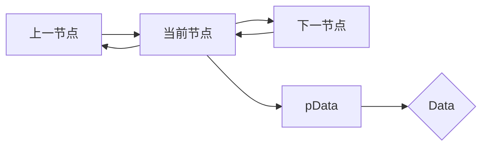
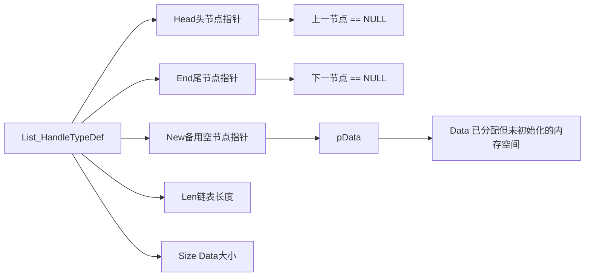
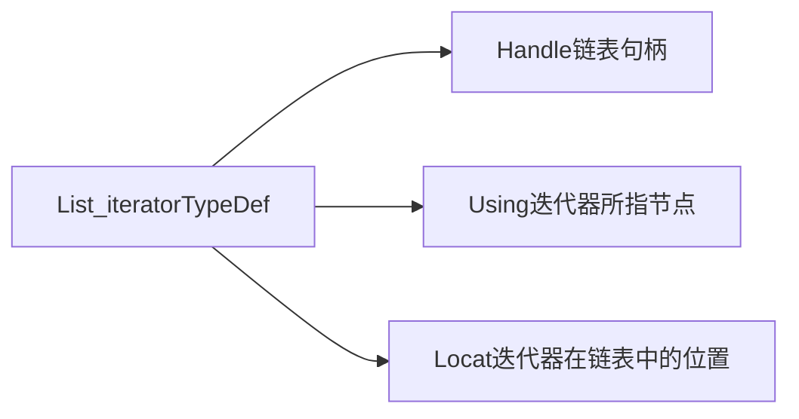

# CList
C语言仿STL链表

# 〇、声明
本代码完全开源，可以用于任意用途，但代码并未做完善的测试，性能也不能保障，主要用于初学者学习
# 一、原理
普通的单向链表的原理就是一个节点存储着数据和指向下一个节点的指针，然后一节指向下一节，形成一个非常形象的“链”。本文的链表是双向的链表，不光存储下一个节点的指针，还存储上一个节点的指针，也就是除了能找到当前节点的下一个节点，还能反向找到上一个节点。
泛型的基本原理就是利用“万能指针”void* 强制类型转换的通用性，基础节点数据类型就是一个void*指针，在这个指针上分配相应大小的内存来实现存储任意类型数据。读取数据的时候再通过强制类型转换还原。
# 二、功能对照
C++ std::List| C List | 说明
-------- | ----------------- | ---------------------
rbegin | List_iterator_mov_head | 移动迭代器至首元素
rend | List_iterator_mov_end | 移动迭代器至尾元素
empty  | List_empty | 判断链表是否为空
size | __List_size | 链表元素个数
front | __List_read_front | 读取首节点
back | __List_read_back | 读取尾节点
push_front | __List_push_front | 添加元素到链表头
pop_front | List_pop_front | 移除首元素
push_back| __List_push_back | 添加元素到链表尾
pop_back | List_pop_back | 移除尾元素
insert | __List_iterator_insert | 在迭代器位置后插入元素
resize | List_resize | 将长度改为只容纳n个元素
(析构函数) | List_Delete | 删除链表
(构造函数) | List_Creat | 初始化链表
remove_if | List_remove_if | 按条件删除元素
(拷贝函数) | List_copy | 链表拷贝
iterator::operator++ | List_iterator_mov_front | 向前移动迭代器
iterator::operator-- | List_iterator_mov_back | 向后移动迭代器
iterator::operator* | __List_iterator_read | 返回迭代器所指元素数据
erase | List_iterator_erase / List_iterator_erase_area | 移除迭代器所指元素/移除两迭代器范围内元素，包括两迭代器所指元素
# 三、特有功能
使链表操作类似于数组的功能
名称 | 功能
-------|--------
List_iterator_mov_goto | 移动迭代器至指定元素
__List_iterator_mov_offset | 移动迭代器指定偏移量
__List_iterator_return_locat | 返回迭代器所在的位置

# 四、使用方法
 - List_HandleTypeDef是链表的控制结构体，存储链表寻址，大小等信息，是链表的核心。
 - List_HandleTypeDef定义后一定要使用List_Creat进行初始化。
 - 迭代器定义后一定要使用List_iterator_Init进行初始化。
 - List_copy的源链表必须非空，输出链表必须是未初始化的。
 - 读取链表内容的时候需要传入类型，类型必须和创建该链表时使用的类型相符。
 - 双下划线开头的函数均为宏函数。
 - 该链表一般情况下不会访问野指，如果误操作会有返回值检查。
 - 链表使用完一定要使用List_Delete释放，如果再栈空间内Handle被释放掉而位于堆空间的动态内存没有释放就会造成内存泄漏。
 - 具体的函数使用说明再List.h里有详细注释

# 五、基本数据结构
节点结构

List_HandleTypeDef结构

List_iteratorTypeDef结构
